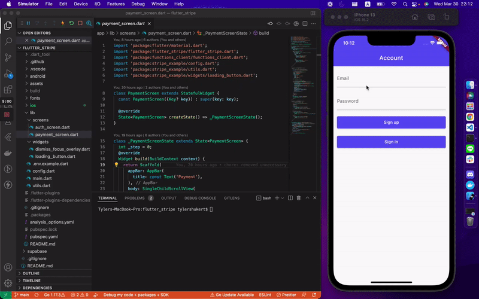

# Stripe payments in Flutter with Supabase Edge Functions

A Flutter app that takes payments with the
[Stripe Payment Sheet](https://docs.stripe.com/payments/accept-a-payment?platform=react-native&ui=payment-sheet),
using Supabase Auth to identify the customer and a Supabase Edge Function to
talk to Stripe.



## How it works

1. The user signs in with Supabase Auth.
2. The app invokes the `payment-sheet` Edge Function with the user's session.
3. The function looks up the user's Stripe customer in the `customers` table,
   or creates one, then creates a PaymentIntent and a CustomerSession.
4. The app presents the Payment Sheet with those secrets. Saved cards, Apple Pay
   and Google Pay are handled by Stripe.

The Stripe secret key and the Supabase secret key only ever live in the Edge
Function. The app only holds publishable keys.

## Requirements

- Flutter 3.41 or later
- The [Supabase CLI](https://supabase.com/docs/guides/local-development/cli/getting-started)
- A [Stripe account](https://dashboard.stripe.com/register) in test mode
- Docker, for local development only

## Run against a hosted Supabase project

1. Create a project on [supabase.com](https://supabase.com/dashboard), then
   link this repository to it and create the `customers` table:

   ```sh
   supabase login
   supabase link --project-ref <your-project-ref>
   supabase db push
   ```

2. Add your Stripe secret key from the
   [Stripe dashboard](https://dashboard.stripe.com/test/apikeys) and deploy the
   function:

   ```sh
   cp supabase/functions/.env.example supabase/functions/.env
   # Set STRIPE_SECRET_KEY=sk_test_... in supabase/functions/.env
   supabase secrets set --env-file supabase/functions/.env
   supabase functions deploy payment-sheet
   ```

   `SUPABASE_URL` and `SUPABASE_SERVICE_ROLE_KEY` are provided to the function
   automatically.

3. Configure and run the app:

   ```sh
   cd app
   cp config.example.json config.json
   ```

   Fill in `config.json` with your project URL and publishable key from
   **Project Settings > API Keys**, and your Stripe publishable key
   (`pk_test_...`). Never put a secret key in this file, it is compiled into the
   app.

   ```sh
   flutter run --dart-define-from-file=config.json
   ```

New hosted projects require email confirmation, so confirm the sign-up email
before signing in.

## Run locally

```sh
supabase start
cp supabase/functions/.env.example supabase/functions/.env
# Set STRIPE_SECRET_KEY=sk_test_... in supabase/functions/.env
supabase functions serve
```

`supabase start` applies the migration and prints the API URL and publishable
key. Put them in `app/config.json`, using `http://10.0.2.2:54321` as the URL on
the Android emulator, and run the app as above. Email confirmation is off
locally, so you can sign in right after creating an account.

Run `supabase stop` when you are done.

## Apple Pay and Google Pay

- **Apple Pay** needs a
  [merchant identifier](https://docs.stripe.com/apple-pay?platform=react-native#merchantid)
  registered with Apple and Stripe. Replace
  `merchant.io.supabase.stripepayments` in
  `app/ios/Runner/Runner.entitlements` and pass the same value as
  `STRIPE_MERCHANT_IDENTIFIER` in `config.json`.
- **Google Pay** runs against the test environment
  (`PaymentSheetGooglePay(testEnv: true)` in
  `app/lib/screens/payment_screen.dart`). Set it to `false` when you switch to
  live keys.

Use the [Stripe test cards](https://docs.stripe.com/testing), such as
`4242 4242 4242 4242`, to make test payments.
